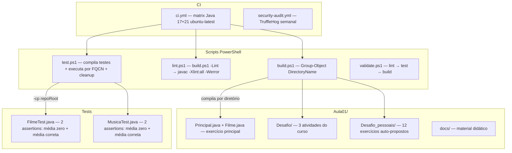

<div align="center">

# Aplicando Orientação a Objetos

[](https://github.com/ESousa97/aplicando-orientacao-a-objetos/actions/workflows/ci.yml)
[](https://www.codefactor.io/repository/github/esousa97/aplicando-orientacao-a-objetos)
[](https://opensource.org/licenses/MIT)
[](#)

**Repositório prático com exercícios progressivos de orientação a objetos em Java — `Aula01/` com classe `Filme` (5 atributos + avaliação com média e guard zero) e `Principal` (instanciação "The Matrix"), 3 atividades do curso (Pessoa, Calculadora, Musica com ficha técnica e sistema de avaliações), 12 exercícios auto-propostos (Carro, Quadrado, Mensagem, Matemática, MaiorNumero com if/else, Tabuada com for loop, Aluno com média de notas, Lampada, Retangulo, Cachorro, perímetro, Pessoa com parâmetro), build por diretório isolado via PowerShell (`Group-Object DirectoryName`), lint com `javac -Xlint:all -Werror`, testes Java puro sem framework (`assertEquals` custom com `DELTA 0.0001`), CI com matrix Java 17+21 e TruffleHog semanal.**

</div>

---

> **⚠️ Projeto Arquivado**
> Este projeto não recebe mais atualizações ou correções. O código permanece disponível como referência e pode ser utilizado livremente sob a licença MIT. Fique à vontade para fazer fork caso deseje continuar o desenvolvimento.

---

## Índice

- [Sobre o Projeto](#sobre-o-projeto)
- [Funcionalidades](#funcionalidades)
- [Tecnologias](#tecnologias)
- [Arquitetura](#arquitetura)
- [Estrutura do Projeto](#estrutura-do-projeto)
- [Começando](#começando)
  - [Pré-requisitos](#pré-requisitos)
  - [Instalação](#instalação)
  - [Uso](#uso)
- [Scripts Disponíveis](#scripts-disponíveis)
- [Exercícios](#exercícios)
- [Testes](#testes)
- [Qualidade e Segurança](#qualidade-e-segurança)
- [FAQ](#faq)
- [Licença](#licença)
- [Contato](#contato)

---

## Sobre o Projeto

Repositório educacional para prática progressiva de orientação a objetos em Java, cobrindo classes, objetos, atributos, métodos, encapsulamento e composição. O conteúdo foi estruturado com padrão de engenharia de software para facilitar execução, validação e evolução.

O repositório prioriza:

- **3 grupos de exercícios progressivos** — `Aula01/` raiz com `Filme` (5 atributos públicos + 2 privados para avaliação, `exibeFichaTecnica()`, `avalia(double)`, `pegaMedia()` com guard `totalDeAvaliacoes == 0`) e `Principal` (instanciação com "The Matrix", 3 avaliações, média); `Desafio/` com 3 atividades do curso (Pessoa→"Olá mundo!", Calculadora→dobro, Musica com sistema de avaliações idêntico ao Filme); `Desafio_pessoais/` com 12 exercícios auto-propostos cobrindo classes, construtores, métodos com parâmetros, retorno, loops e condicionais
- **Build por diretório isolado** — `build.ps1` usa `Get-ChildItem + Group-Object DirectoryName` para compilar cada diretório independentemente, evitando conflitos de classes com mesmo nome em exercícios distintos. Flag `-KeepClassFiles` para manter `.class` (usado pelo test), flag `-Lint` para ativar warnings como erros
- **Testes Java puro sem framework** — `FilmeTest` e `MusicaTest` com `assertEquals(double, double, String)` custom usando `DELTA 0.0001` e `AssertionError`. `test.ps1` compila com `-cp $repoRoot`, extrai `package` e `class` via regex, executa por FQCN, limpa `.class` e `.tmp-test-classes` automaticamente
- **CI com matrix Java 17+21** — GitHub Actions em `ubuntu-latest` com shell `pwsh`: lint → test → build. Security Audit semanal com TruffleHog OSS (`--only-verified`)
- **Documentação didática** — `docs/Classes-e-objetos.md` com explicação conceitual de classes, objetos, `new`, atributos e métodos. `docs/Desafio-pratico.md` com enunciados das atividades

---

## Funcionalidades

### Exercício Principal — Filme

- Classe `Filme` com 5 atributos públicos (`nome`, `anoDeLancamento`, `duracaoEmMinutos`, `incluidoNoPlano`) + 2 privados (`somaDasAvaliacoes`, `totalDeAvaliacoes`)
- `exibeFichaTecnica()` — imprime todos os dados do filme
- `avalia(double nota)` — acumula nota e incrementa contador
- `pegaMedia()` — retorna média com guard de divisão por zero
- `Principal` — instanciação com "The Matrix" (1999, 135min, no plano), 3 avaliações (9, 8, 9)

### Desafios do Curso (3 atividades)

- **Atividade 1** — Classe `pessoa` com atributo `frase` e método `exibeOlaMundo()`
- **Atividade 2** — Classe `calculadora` com método `dobro(int)` retornando `numero * 2`
- **Atividade 3** — Classe `Musica` com `titulo`, `artista`, `anoLancamento`, sistema de avaliações (mesma lógica do `Filme`), `exibeFichaTecnica()` e `pegaMedia()`

### Exercícios Auto-propostos (12 práticas)

| # | Classe | Conceito Praticado |
| --- | --- | --- |
| 1 | `Carro` | Atributo String + método void |
| 2 | `Quadrado` | Construtor com parâmetro + `calcularArea()` (lado × lado) |
| 3 | `Mensagem` | Método com parâmetro String |
| 4 | `Matematica` | Método com retorno int (`triplo`) |
| 5 | `MaiorNumero` | Condicional `if/else` |
| 6 | `Tabuada` | Loop `for` (1 a 10) |
| 7 | `Aluno` | Média aritmética de 3 notas `double` com `printf` |
| 8 | `Lampada` | Atributo + método void simples |
| 9 | `Retangulo` | Método com 2 parâmetros (`base × altura`) |
| 10 | `Cachorro` | Atributo String + método void |
| 11 | `Quadrado` | Construtor + `calculaPerimetro()` (4 × lado) |
| 12 | `Pessoa` | Atributo String + método void |

---

## Tecnologias


---

## Arquitetura



### Decisões de Design

| Decisão | Justificativa |
| --- | --- |
| Build por diretório | Evita conflitos de classes com mesmo nome em exercícios distintos (ex.: dois `Quadrado.java`) |
| Testes sem framework externo | Reduz complexidade em projeto educacional sem gerenciador de dependências |
| `assertEquals` custom com DELTA | Comparação de `double` com tolerância `0.0001` sem JUnit |
| Matrix Java 17+21 | Garante compatibilidade com as duas versões LTS ativas |
| PowerShell como shell único | Disponível em ubuntu-latest via `pwsh`, cross-platform Windows/Linux |
| Pacotes por diretório (`Aula01.Desafio_pessoais.praticandoN`) | Isolamento natural de exercícios sem colisão de nomes |

---

## Estrutura do Projeto

```
aplicando-orientacao-a-objetos/
├── Aula01/
│   ├── Filme.java                              # 5 atributos + avaliação com média e guard zero
│   ├── Principal.java                          # Instanciação "The Matrix", 3 avaliações
│   ├── Desafio/
│   │   ├── Desafio_Hora_Pratica.md             # Enunciados do curso (5 atividades)
│   │   ├── Atividade1/                         # pessoa + metodo → "Olá mundo!"
│   │   │   ├── pessoa.java
│   │   │   └── metodo.java
│   │   ├── Atividade2/                         # calculadora → dobro(int)
│   │   │   ├── calculadora.java
│   │   │   └── principal.java
│   │   └── Atividade3/                         # Musica com ficha técnica + avaliações
│   │       ├── Musica.java
│   │       └── metodoMusica.java
│   ├── Desafio_pessoais/
│   │   ├── Questoes.md                         # Enunciados (12 questões)
│   │   ├── praticando1/                        # Carro → exibirTexto()
│   │   ├── praticando2/                        # Quadrado → calcularArea() com construtor
│   │   ├── praticando3/                        # Mensagem → mensagemRecebida(String)
│   │   ├── praticando4/                        # Matematica → triplo(int)
│   │   ├── praticando5/                        # MaiorNumero → if/else
│   │   ├── praticando6/                        # Tabuada → for loop 1 a 10
│   │   ├── praticando7/                        # Aluno → média 3 notas com printf
│   │   ├── praticando8/                        # Lampada → lampadaAcesa()
│   │   ├── praticando9/                        # Retangulo → valorArea(base, altura)
│   │   ├── praticando10/                       # Cachorro → exibirMensagem()
│   │   ├── praticando11/                       # Quadrado → calculaPerimetro() com construtor
│   │   └── praticando12/                       # Pessoa → exibeFala()
│   └── docs/
│       ├── Classes-e-objetos.md                # Explicação conceitual: classes, new, atributos, métodos
│       └── Desafio-pratico.md                  # Enunciados das atividades do curso
├── tests/
│   ├── unit/
│   │   ├── Aula01/
│   │   │   ├── FilmeTest.java                  # 2 testes: média zero + (7+9)/2=8.0
│   │   │   └── Desafio/Atividade3/
│   │   │       └── MusicaTest.java             # 2 testes: média zero + (8+6+10)/3=8.0
│   ├── integration/                            # .gitkeep (reservado)
│   └── e2e/                                    # .gitkeep (reservado)
├── scripts/
│   ├── build.ps1                               # Build por diretório com -Lint e -KeepClassFiles
│   ├── lint.ps1                                # Delega para build.ps1 -Lint
│   ├── test.ps1                                # Compila testes, executa por FQCN, cleanup
│   └── validate.ps1                            # lint → test → build
├── docs/
│   ├── architecture.md                         # Build por diretório, testes sem framework, matrix
│   └── setup.md                                # Execução, troubleshooting JAVA_HOME
├── .github/
│   ├── workflows/
│   │   ├── ci.yml                              # Matrix Java 17+21, shell pwsh, ubuntu-latest
│   │   └── security-audit.yml                  # TruffleHog OSS semanal (--only-verified)
│   ├── ISSUE_TEMPLATE/
│   │   ├── bug_report.yml                      # Com aviso de archived
│   │   ├── feature_request.yml
│   │   └── config.yml                          # Blank issues disabled
│   ├── PULL_REQUEST_TEMPLATE.md
│   ├── CODEOWNERS
│   ├── FUNDING.yml
│   └── dependabot.yml                          # GitHub Actions (PRs desabilitados)
├── .editorconfig                               # UTF-8, LF, indent 2
├── .gitattributes                              # LF normalizado
├── .gitignore                                  # *.class, .tmp-test-classes, .env
├── .env.example                                # JAVA_TOOL_OPTIONS, APP_ENV, JAVA_HOME
├── CHANGELOG.md                                # Keep a Changelog (v1.0.0 → v1.0.1)
├── CONTRIBUTING.md                             # Conventional Commits + quality checks
├── CODE_OF_CONDUCT.md                          # Contributor Covenant 2.1
├── SECURITY.md                                 # Política de disclosure
└── LICENSE                                     # MIT
```

---

## Começando

### Pré-requisitos

- Java JDK 17 ou superior (21 recomendado)
- PowerShell 7+ (ou Windows PowerShell 5.1)

### Instalação

```bash
git clone https://github.com/ESousa97/aplicando-orientacao-a-objetos.git
cd aplicando-orientacao-a-objetos
```

### Uso

**Validação completa:**

```powershell
pwsh -File scripts/validate.ps1
```

**Executar exercício principal:**

```bash
javac Aula01/Principal.java Aula01/Filme.java
java Aula01.Principal
```

**Saída:**

```text
Nome do filme: The Matrix
Ano de lançamento: 1999
Duração em minutos: 135
Incluído no plano: true
Média de avaliações do filme: 8.666666666666666
```

---

## Scripts Disponíveis

| Script | Descrição |
| --- | --- |
| `pwsh -File scripts/build.ps1` | Compila todos os diretórios Java isoladamente (`Group-Object DirectoryName`) |
| `pwsh -File scripts/build.ps1 -Lint` | Compila com `javac -Xlint:all -Werror` |
| `pwsh -File scripts/build.ps1 -KeepClassFiles` | Mantém `.class` após build (usado pelo test) |
| `pwsh -File scripts/lint.ps1` | Delega para `build.ps1 -Lint` |
| `pwsh -File scripts/test.ps1` | Compila testes, executa por FQCN, limpa artefatos |
| `pwsh -File scripts/validate.ps1` | Pipeline: lint → test → build |

---

## Exercícios

<details>
<summary><strong>Aula01/ — Exercício Principal (Filme)</strong></summary>

- `Filme.java` — Classe com 5 atributos públicos (`nome`, `anoDeLancamento`, `duracaoEmMinutos`, `incluidoNoPlano`) + 2 privados para encapsulamento de avaliações (`somaDasAvaliacoes`, `totalDeAvaliacoes`). Métodos: `exibeFichaTecnica()`, `avalia(double nota)`, `pegaMedia()` com guard de divisão por zero
- `Principal.java` — Instancia "The Matrix" (1999, 135 minutos, incluído no plano), executa 3 avaliações (9, 8, 9) e imprime média

</details>

<details>
<summary><strong>Desafio/ — 3 Atividades do Curso</strong></summary>

| Atividade | Classes | Conceito |
| --- | --- | --- |
| 1 | `pessoa` + `metodo` | Classe com atributo String + método void ("Olá mundo!") |
| 2 | `calculadora` + `principal` | Método com parâmetro int e retorno (`dobro`) |
| 3 | `Musica` + `metodoMusica` | Atributos + encapsulamento privado + sistema de avaliações com média |

</details>

<details>
<summary><strong>Desafio_pessoais/ — 12 Exercícios Auto-propostos</strong></summary>

Cada exercício em `praticandoN/` com classe de domínio + classe main. Cobrem: atributos simples, construtores com parâmetro (`this.lado = lado`), métodos void e com retorno, parâmetros String/int/double, condicionais (`if/else`), loops (`for`), formatação com `printf`.

</details>

---

## Testes

```powershell
pwsh -File scripts/test.ps1
```

**4 assertions em 2 classes de teste** (Java puro sem framework):

| Teste | Classe | Validação | Valores |
| --- | --- | --- | --- |
| `deveRetornarMediaZeroSemAvaliacoes` | `FilmeTest` | `pegaMedia()` retorna 0.0 sem avaliações | `expected: 0.0` |
| `deveCalcularMediaCorretamente` | `FilmeTest` | `avalia(7) + avalia(9)` → média 8.0 | `(7+9)/2 = 8.0` |
| `deveRetornarMediaZeroSemAvaliacoes` | `MusicaTest` | `pegaMedia()` retorna 0.0 sem avaliações | `expected: 0.0` |
| `deveCalcularMediaCorretamente` | `MusicaTest` | `avalia(8) + avalia(6) + avalia(10)` → média 8.0 | `(8+6+10)/3 = 8.0` |

Implementação: `assertEquals(double expected, double actual, String message)` com tolerância `DELTA = 0.0001`, lança `AssertionError` em caso de falha.

**Fluxo do `test.ps1`:** Build com `-KeepClassFiles` → compila testes com `-cp $repoRoot` em `.tmp-test-classes` → extrai package/class via regex → executa cada teste por FQCN → limpa `.class` e `.tmp-test-classes`.

---

## Qualidade e Segurança

- **CI** — GitHub Actions com matrix Java 17+21 em `ubuntu-latest`, shell `pwsh`: Lint → Test → Build
- **Security Audit** — TruffleHog OSS semanal (segunda 08:00 UTC) com `--only-verified`
- **Dependabot** — GitHub Actions (PRs desabilitados — projeto archived)
- **Governança** — Issue templates YAML com aviso de archived, PR template com checklist, CODEOWNERS, FUNDING.yml

---

## FAQ

<details>
<summary><strong>Por que build por diretório e não compilação global?</strong></summary>

Exercícios distintos podem ter classes com o mesmo nome (ex.: dois `Quadrado.java` com implementações diferentes — um para área, outro para perímetro). O `build.ps1` usa `Group-Object DirectoryName` para compilar cada diretório isoladamente, evitando conflitos de pacote.
</details>

<details>
<summary><strong>Por que testes sem JUnit?</strong></summary>

O projeto é educacional e não usa gerenciador de dependências (Maven/Gradle). Os testes usam `assertEquals` custom com `DELTA 0.0001` para comparação de `double` e `AssertionError` nativo do Java, mantendo zero dependências externas.
</details>

<details>
<summary><strong>O CI usa Java 17 e 21 — qual é o mínimo?</strong></summary>

Java 17 é o mínimo. A matrix garante compatibilidade com as duas versões LTS ativas. Os exercícios não usam features exclusivas do Java 21, então compilam em ambas.
</details>

<details>
<summary><strong>Posso executar exercícios individuais sem PowerShell?</strong></summary>

Sim. Compile e execute diretamente com `javac` e `java`. Por exemplo: `javac Aula01/Desafio_pessoais/praticando6/Tabuada.java Aula01/Desafio_pessoais/praticando6/Resultado.java && java Aula01.Desafio_pessoais.praticando6.Resultado`.
</details>

---

## Licença

Este projeto está sob a licença MIT. Veja o arquivo [LICENSE](LICENSE) para mais detalhes.

```
MIT License - você pode usar, copiar, modificar e distribuir este código.
```

---

## Contato

**José Enoque Costa de Sousa**

[](https://www.linkedin.com/in/enoque-sousa-bb89aa168/)
[](https://github.com/ESousa97)
[](https://enoquesousa.vercel.app)

---

<div align="center">

**[⬆ Voltar ao topo](#aplicando-orientação-a-objetos)**

Feito com ❤️ por [José Enoque](https://github.com/ESousa97)

**Status do Projeto:** Archived — Sem novas atualizações

</div>
